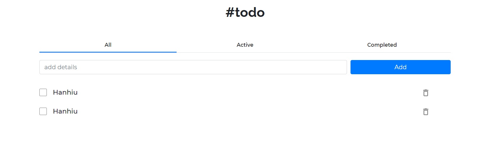

<!-- TABLE OF CONTENTS -->


<!-- ABOUT THE PROJECT -->
## About The Project



### Built With
* [React](https://reactjs.org)
* [React-Bootstrap](https://react-bootstrap.github.io)

<!-- GETTING STARTED -->
## Getting Started

### Prerequisites

* npm
```sh
npm install npm@latest -g
```

### Installation

1. Clone the repo
```sh
git clone https://github.com/kctrnn/todo-app.git
```
2. Install NPM packages
```sh
npm install
```

<!-- USAGE EXAMPLES -->
## Usage

```sh
npm start
```

<!-- ROADMAP -->

<!-- CONTRIBUTING -->


<!-- LICENSE -->
<!-- CONTACT -->
## Contact

Your Name - [@Kim Chan](https://www.facebook.com/kctrnn) - kctrnn@gmail.com

Project Link: [https://github.com/kctrnn/todo-app.git](https://github.com/kctrnn/todo-app.git)


<!-- ACKNOWLEDGEMENTS -->
## Acknowledgements
* [Material Icons](https://google.github.io/material-design-icons)


